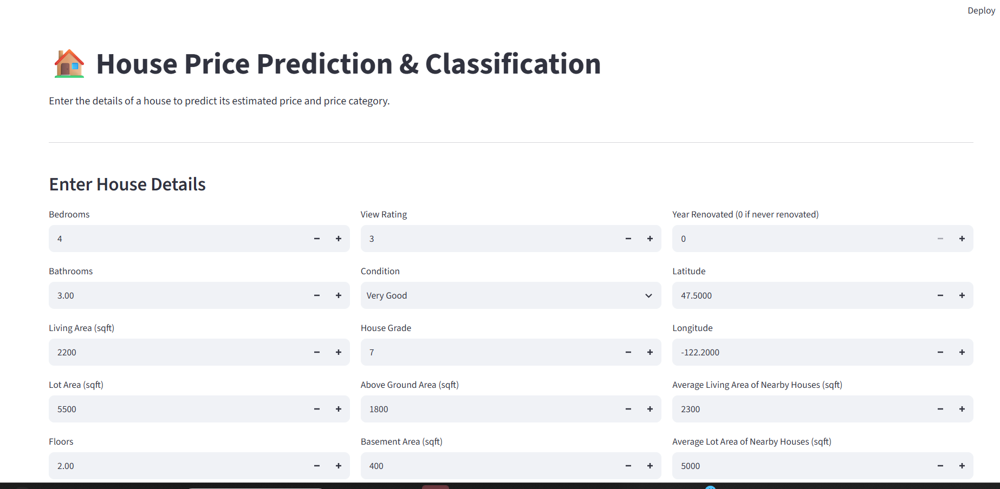
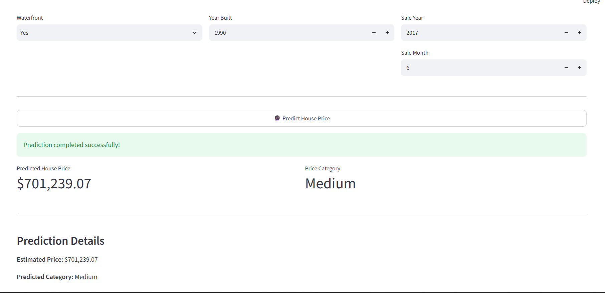
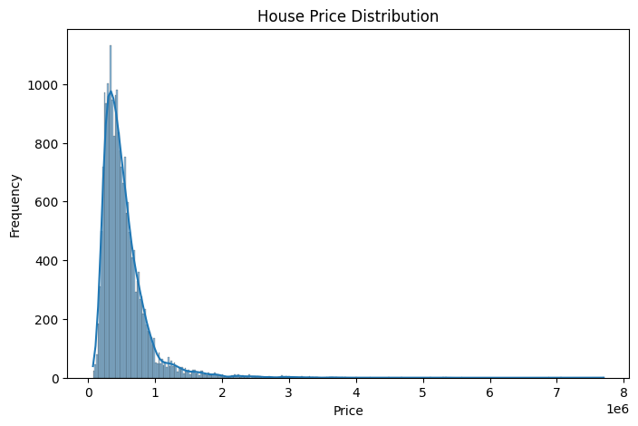
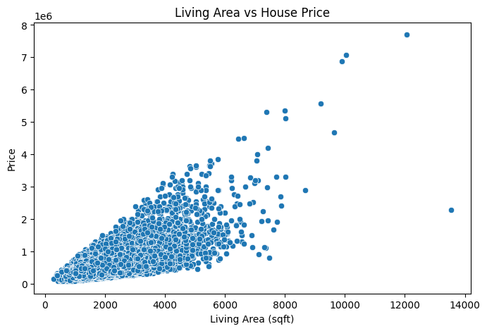

# House Price Prediction & Classification

## Live Demo

[Try the House Price Prediction App](https://house-price-prediction-cbhuhbafuvy4yq2ryzhzht.streamlit.app)

## Project Overview

This project uses machine learning to analyze house prices and build two predictive systems:

1. **House Price Prediction** – predicts the estimated price of a house.
2. **Price Category Classification** – classifies houses into Low, Medium, or High price categories.

The project follows a complete machine learning workflow including data preprocessing, exploratory data analysis, feature engineering, model training, evaluation, feature importance analysis, and prediction.

---

## Objectives

- Analyze factors affecting house prices.
- Perform exploratory data analysis.
- Clean and preprocess the dataset.
- Train multiple regression models.
- Train multiple classification models.
- Compare model performance.
- Predict house prices for new inputs.
- Classify houses into price categories.

---

## Technologies Used

- Python
- Pandas
- NumPy
- Matplotlib
- Seaborn
- Scikit-learn
- Joblib
- Jupyter Notebook
- Streamlit
- Git & GitHub

---

## 📊 Dataset

The dataset contains information about houses, including:

- Number of bedrooms
- Number of bathrooms
- Living area
- Lot area
- Floors
- Waterfront
- View
- Condition
- Grade
- Basement area
- Year built
- Renovation year
- Location coordinates
- Nearby house living area
- Nearby house lot area
- Sale date
- House price

The dataset was obtained from Kaggle. The original dataset license and attribution are preserved in the project.

------

## 🔄 Machine Learning Workflow

```text
Dataset
   ↓
Data Cleaning
   ↓
Exploratory Data Analysis
   ↓
Feature Engineering
   ↓
Train-Test Split
   ↓
Regression Models
   ↓
Classification Models
   ↓
Model Evaluation
   ↓
Save Trained Models
   ↓
Streamlit Application
   ↓
Deployment

------

## Machine Learning Models

### Regression

- Linear Regression
- Decision Tree Regressor
- Random Forest Regressor

### Classification

- Logistic Regression
- Decision Tree Classifier
- Random Forest Classifier

---

## Regression Results

| Model | MAE | RMSE | R² Score |
|---|---:|---:|---:|
| Linear Regression | 127,642 | 213,958 | 0.6972 |
| Decision Tree | 96,372 | 193,124 | 0.7533 |
| Random Forest | 74,112 | 151,611 | 0.8480 |

---

## Classification Results

| Model | Accuracy | Precision | Recall | F1 Score |
|---|---:|---:|---:|---:|
| Logistic Regression | 73.44% | 73.89% | 73.44% | 73.62% |
| Decision Tree | 80.04% | 80.31% | 80.04% | 80.15% |
| Random Forest | 83.81% | 84.08% | 83.81% | 83.91% |

---

## Key Insights

- Living area has a strong relationship with house price.
- Property grade is an important feature for price prediction.
- Geographic location, represented by latitude and longitude, contributes significantly to model predictions.
- Waterfront properties show substantially different price distributions.
- Random Forest captured nonlinear relationships better than Linear Regression for this dataset.
- The Medium price category was more difficult to classify than the Low and High categories.

---

🌐 Streamlit Application

The project includes an interactive Streamlit application where users can enter house details and receive:

- Predicted house price
- Predicted price category

```markdown
-----

## 📸 Application & Analysis Screenshots

### Streamlit Application



### Prediction Result



### Price Distribution



### Living Area vs Price



-----

## Project Structure

House-Price-Prediction/
│
├── app.py
├── README.md
├── requirements.txt
│
├── data/
│   └── house_prices.csv
│
├── models/
│   ├── house_price_regression_model.pkl
│   └── house_price_classification_model.pkl
│
└── notebooks/
    └── house_price_prediction.ipynb

-----

🔮 Future Improvements
Hyperparameter tuning
Cross-validation
More advanced regression models
Improved feature engineering
Better handling of price-category thresholds
Additional interactive visualizations
Model monitoring

-----

👩‍💻 Author
Tanushree Sapkale

Computer Engineering Student